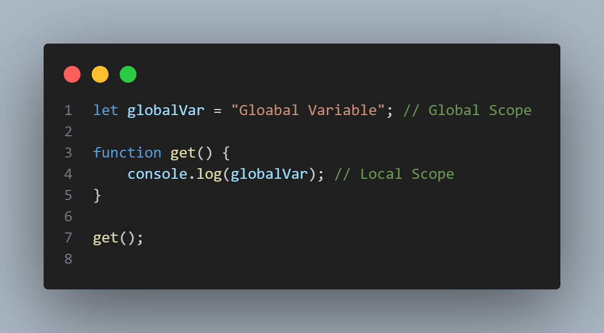
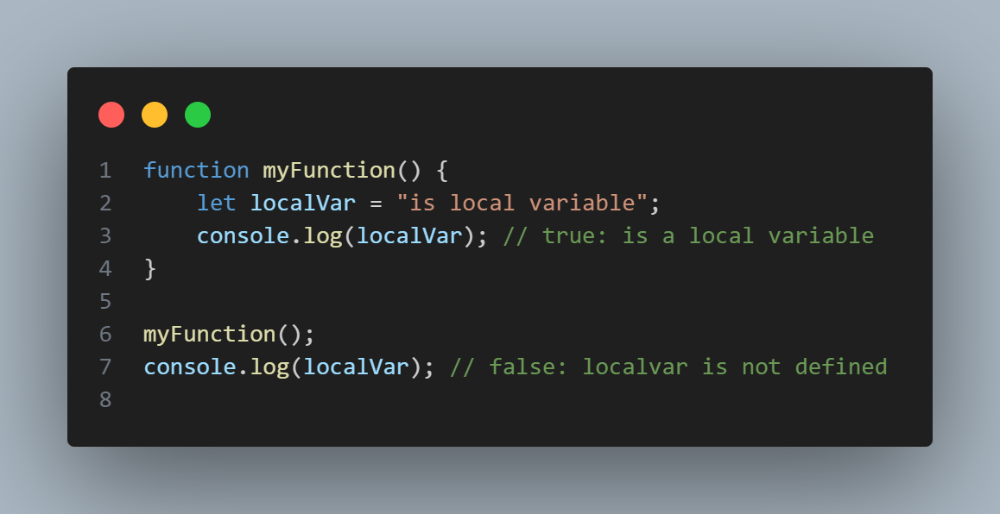
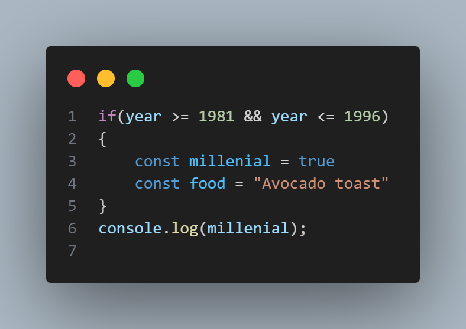

# Дар ин файли readme двр бораи 
- Scope
- Hoising
- TDZ
# каме маълумот мегиред
# Scope :
## Дар JavaScript, Scope (доираи таъсир) & (прицел) маънои он аст, ки кадом қисмҳои барномаи JavaScript метавонанд ба як тағйирёбанда ё функсия дастрасӣ дошта бошанд. Scope нишон медиҳад, ки тағйирёбандаҳо дар кадом мавқеъ эълон мешаванд ва то куҷо дастрасанд. Дар JavaScript, ду навъи асосии scope мавҷуд аст:
# 1 - Global Scope 
# 2 - local Scope 
- function Scope
- Block Scope
# Global Scope  - Тағйирёбандаҳое, ки дар сатҳи глобалӣ эълон мешаванд, дар тамоми барнома дастрасанд. Агар шумо тағйирёбандае эълон кунед бе истифодаи let, const ё var, он ба таври худкор глобалӣ мешавад.
# Example: 

---
---
---
# Local Scope - Тағйирёбандаҳое, ки дар дохили функсия ё блок эълон мешаванд, танҳо дар дохили ҳамон функсия ё блок дастрасанд. Тағйирёбандаҳои маҳаллӣ бо истифодаи let, const ё var эълон мешаванд.
# чи тавре гуфта будам Local Scope ба ду навъ таксим мешавад:
- function Scope
- Block Scope
# Function Scope - Тағйирёбандаҳое, ки дар дохили функсия эълон шудаанд, танҳо дар дохили ҳамон функсия дастрасанд.
# Example:

# Block Scope - Тағйирёбандаҳое, ки дар дохили if - for condition - loops - эълон карда шудаанд танҳо дар дохили ҳамон if & loop дастрасанд.
# Example:

