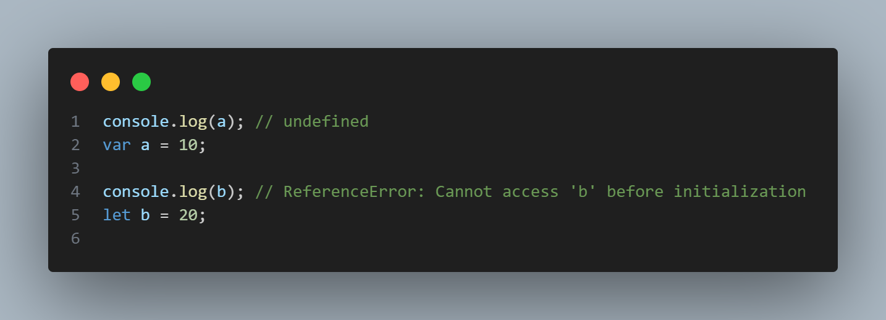
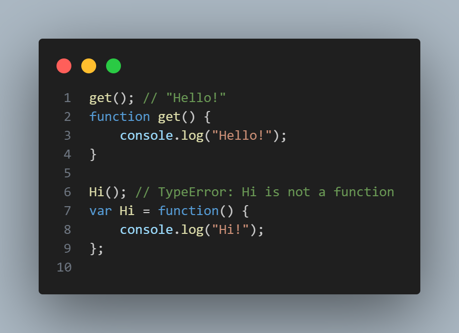
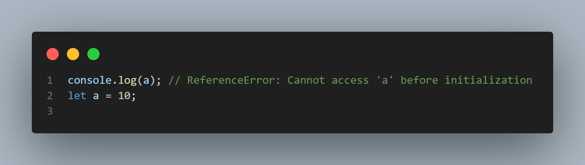
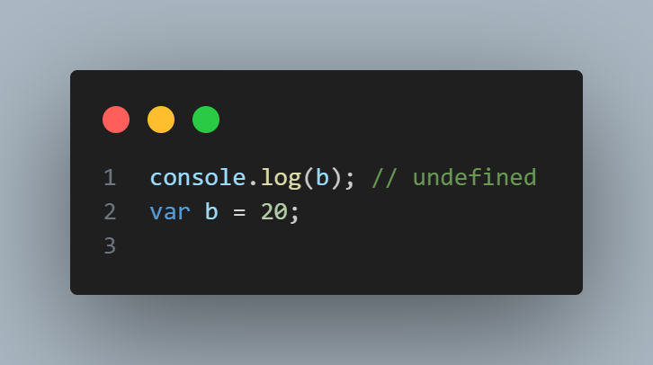
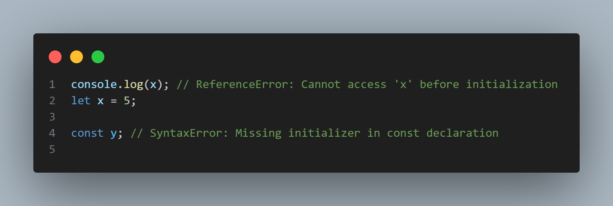

# Дар ин файли readme двр бораи 
- Scope
- Hoising
- TDZ
# каме маълумот мегиред
# Scope :
## Дар JavaScript, Scope (доираи таъсир) & (прицел) маънои он аст, ки кадом қисмҳои барномаи JavaScript метавонанд ба як тағйирёбанда ё функсия дастрасӣ дошта бошанд. Scope нишон медиҳад, ки тағйирёбандаҳо дар кадом мавқеъ эълон мешаванд ва то куҷо дастрасанд. Дар JavaScript, ду навъи асосии scope мавҷуд аст:
# 1 - Global Scope 
# 2 - local Scope 
- function Scope
- Block Scope
# Global Scope  - Тағйирёбандаҳое, ки дар сатҳи глобалӣ эълон мешаванд, дар тамоми барнома дастрасанд. Агар шумо тағйирёбандае эълон кунед бе истифодаи let, const ё var, он ба таври худкор глобалӣ мешавад.
# Example: 

---
---
---
# Local Scope - Тағйирёбандаҳое, ки дар дохили функсия ё блок эълон мешаванд, танҳо дар дохили ҳамон функсия ё блок дастрасанд. Тағйирёбандаҳои маҳаллӣ бо истифодаи let, const ё var эълон мешаванд.
# чи тавре гуфта будам Local Scope ба ду навъ таксим мешавад:
- function Scope
- Block Scope
# Function Scope - Тағйирёбандаҳое, ки дар дохили функсия эълон шудаанд, танҳо дар дохили ҳамон функсия дастрасанд.
# Example:

# Block Scope - Тағйирёбандаҳое, ки дар дохили if - for condition - loops - эълон карда шудаанд танҳо дар дохили ҳамон if & loop дастрасанд.
# Example:

# Дар JavaScript, hoisting як механизмест, ки дар он тағйирёбандаҳо, функсияҳо ва эъломияҳои синфӣ ба таври худкор "боло" (ба қисми болоии ҳудуд) гузаронида мешаванд ҳангоми иҷрои код. Ин маънои онро дорад, ки шумо метавонед онҳоро дар коди худ қабл аз эълон истифода баред, гарчанде ки натиҷа ва рафтор метавонад вобаста ба навъи эълон фарқ кунад.
# Examples
## Бо var: Бо истифодаи var, тағйирёбандаҳо "hoisted" мешаванд ва арзиши ибтидоии онҳо undefined мегардад.
---
## Бо let ва const: Инҳо низ "hoisted" мешаванд, аммо онҳо ба Temporal Dead Zone (TDZ) дохил мешаванд, ки то замони таъйини арзиши аввал дастрас нестанд.

---
# Дар функсия hoisting кор мекунад аммо дар ҳама функсияҳо кор намекунад
# Examples

# Чихел мебинед дар мисоли зерин дар  функсияи expression hoisting кор намекунад.

# (TDZ) - Temporal Dead Zone
- TDZ аз оғози ҳудуд (scope) то нуқтаи таъйини арзиши ибтидоӣ идома меёбад.
- Ҳангоми кӯшиши дастрасӣ ба тағйирёбанда дар TDZ, ReferenceError баргардонида мешавад.
# Мисол мегирем tdz дар вақти hoisting кардан ба вуҷуд меояд

# Ба var дахл надорад:
- Тағйирёбандаҳое, ки бо var эълон шудаанд, ба TDZ дохил намешаванд. Онҳо ҳангоми "hoisting" ба undefined таъйин мешаванд, аммо ин метавонад ба хатогиҳо оварда расонад.

# Бо let ва const:
- Ҳам let ва ҳам const дар TDZ мавҷуданд, аммо фарқият дар он аст, ки let метавонад баъдтар тағйир дода шавад. const бояд фавран бо арзиши ибтидоӣ таъйин гардад

---
---

# Ташаккури Зиёд !!!!!

# барои маълумоти бештар гирифтан дар линки зери дароед [link](https://www.canva.com/design/DAGNPkypksA/KEEkzfVGNV0eMUisnjVbWA/view?utm_content=DAGNPkypksA&utm_campaign=designshare&utm_medium=link&utm_source=editor#10)
